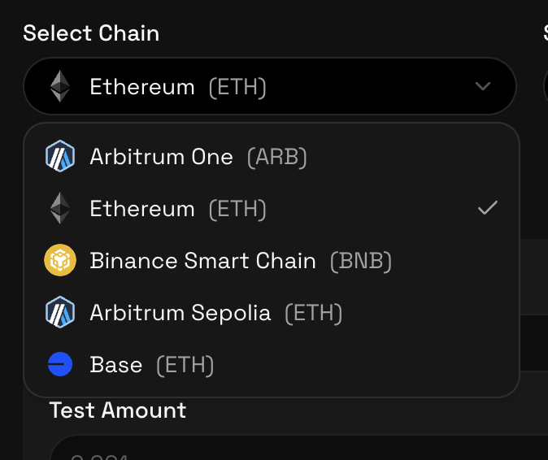
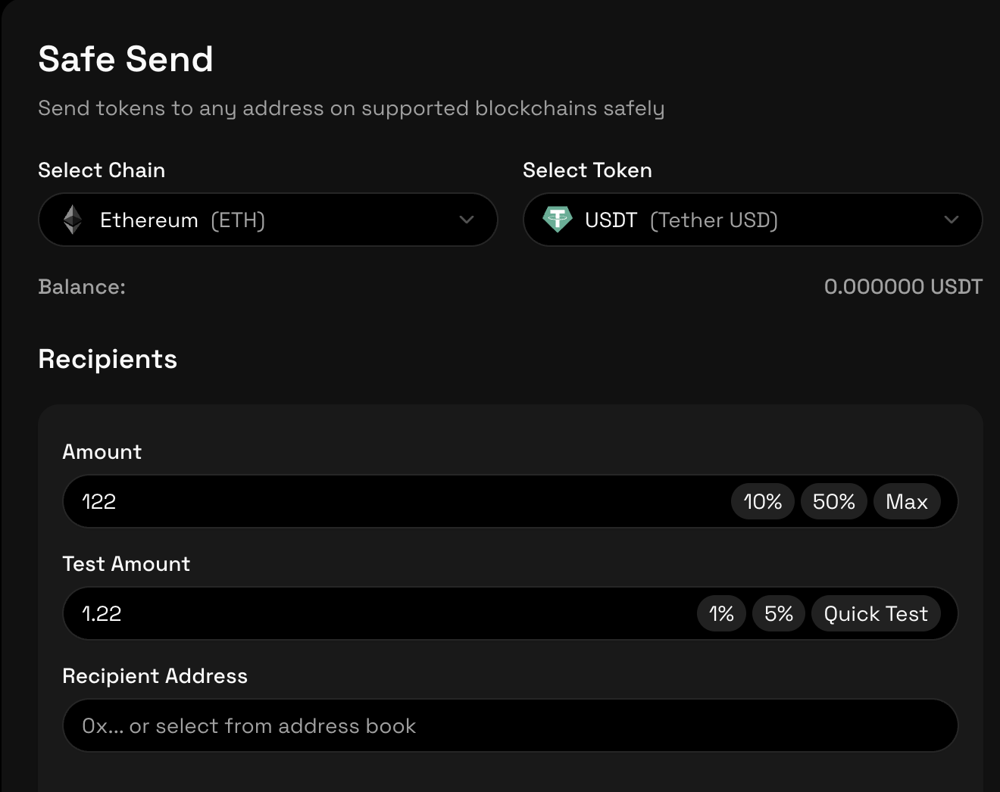

# SafeSend – Secure Token Transfers

## #1 Pre-requisites & Limitations

To use SafeSend, users must have the following:

### Compatible Wallet and Chain

Users must have a compatible wallet. SafeSend supports more than 500 wallets, including MetaMask and WalletConnect-enabled wallets.

SafeSend currently supports the following chains:

- Ethereum
- Arbitrum One
- BNB Smart Chain
- Base

SafeSend also supports the Arbitrum Sepolia testnet.

---

### Sufficient Gas Balance

Users must hold enough native tokens in their wallet to cover transaction costs, including test transactions and final execution.

---

### Telegram Account

A Telegram account is required to receive transaction confirmations and approve transfers before execution.

---

### Transaction Approval

SafeSend requests approval only for the exact transfer amount required.  
This limits token allowances to the intended transaction and reduces the risk of unauthorized or unintended token usage.

---

### Post-transfer Contract Behavior

SafeSend verifies transfers before execution but cannot protect against malicious behavior that may occur after funds are received by a contract.

---

## #2 Why SafeSend Is Needed

Blockchain transactions are inherently irreversible. Once a token transfer is executed on-chain, it cannot be undone, paused, or modified. As a result, even minor errors in DeFi transactions can lead to permanent loss of funds.

This lack of error tolerance remains a major usability challenge and a barrier to broader adoption.

Many existing wallet interfaces prioritize transaction speed and convenience over risk mitigation. As a result, transfers can often be executed with minimal pre-transaction validation, reducing the opportunity to catch errors before they are committed on-chain. This emphasis on efficiency can inadvertently encourage unsafe transfer practices.

### Common Problems

- **Incorrect recipient addresses**  
  Tokens sent to the wrong wallet or smart contract are often unrecoverable, resulting in permanent loss.

- **Excessive token approvals**  
  Many transfer flows rely on unlimited token allowances, which can later be exploited by compromised or malicious contracts.

- **Lack of pre-transfer verification**  
  Standard wallet flows allow users to execute large transfers without validating whether the transaction will behave as expected.

---

### How SafeSend Prevents These Common Mistakes

Since post-transaction recovery is impossible on-chain, SafeSend introduces safeguards directly into the transaction flow so that mistakes are caught before value is moved.

#### 1. Test Transaction Before Full Transfer

Before any large transfer is executed, SafeSend requires a small test transaction.

This test transaction verifies:
- The recipient address is correct and reachable
- The token behaves as expected
- The transaction executes successfully on the selected network

If the test transfer fails or behaves unexpectedly, the main transfer cannot proceed.

This allows mistakes such as wrong addresses, wrong networks, or failing contracts to be caught early with minimal risk.

---

#### 2. Exact-Amount Token Approvals

Instead of requesting unlimited token allowances, SafeSend requests approval only for the exact transfer amount.  
This reduces the risk of unintended or unauthorized token usage.

---

#### 3. Explicit User Confirmation via Telegram

Before the final transfer is executed, transaction details are sent via Telegram and the user must explicitly confirm the transfer.

This adds a human verification step outside the wallet UI, reducing:
- Accidental clicks
- UI spoofing risks
- Blind confirmations during rushed transfers

If confirmation is not given, the transfer does not execute.

---

## #3 Who Is It For?

SafeSend is designed for users who require additional safety and verification when transferring tokens on-chain.

It is particularly relevant for:

- **New cryptocurrency users**  
  Users unfamiliar with on-chain transactions who want additional safeguards against common mistakes such as incorrect addresses, wrong networks, or misconfigured transfers.

- **DeFi traders and power users**  
  Users who execute frequent token transfers and interact with multiple protocols, where cumulative risk from repeated approvals and rushed transactions is higher.

- **Users transferring large token amounts**  
  Transfers involving significant value benefit from pre-transfer verification and explicit confirmation.

- **DAO operators and treasury managers**  
  Teams responsible for managing shared or organizational funds, where transaction errors can have operational or governance impact.

- **Web3 founders and teams**  
  Builders and operators moving funds between wallets, contracts, or networks as part of deployments, operations, or partnerships.

---

## #4 How SafeSend Works

SafeSend introduces a verification-first, approval-based transfer flow.

### Step 1: Connect Wallet

Users connect their existing wallet with a single click.  
No new wallet creation or special setup is required.

---

### Step 2: Send a Test Transfer

Before sending the full amount, a small test transaction is executed.

SafeSend verifies:
- Recipient address
- Token contract behavior
- Network and execution success

This ensures the transfer behaves as expected before real value is moved.

---

### Step 3: Confirm & Send

After successful verification:
- The user explicitly approves the full transfer
- Confirmation is sent via the SafeSend Telegram bot
- The final transaction is executed only after approval

This two-step process prevents silent approvals, infinite allowances, and accidental transfers.
